# watchOS-2-Sampler

Code examples for new features of watchOS 2.

##Requirements

- Xcode 7
- iOS 9 and watchOS 2

##How to build

- Change the "Team" setting on [General] for each target.
- Enable **HealthKit** for the parent app and WatchKit extension target.
- Enable **App Groups** for the Watch app and WatchKit extension target.
  - Edit "AudioRecAndPlayInterfaceController" with your group identifier.
- Build & Run with **Xcode 7**

##Contents

###Animated Properties

Animate width/height, alpha and alignments.

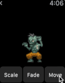

###Table Animations

Insert and remove animations for WKInterfaceTable.

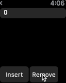

###Picker Styles

WKInterfacePicker styles catalog.

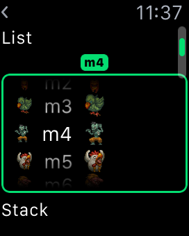

###Taptic Engine

Access to the Taptic engine using `playHaptic` method.

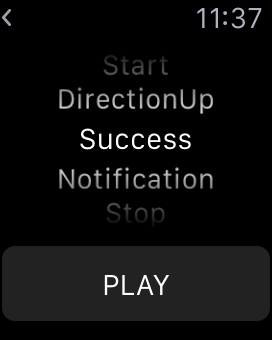

###Audio Rec & Play

Record and play audio.

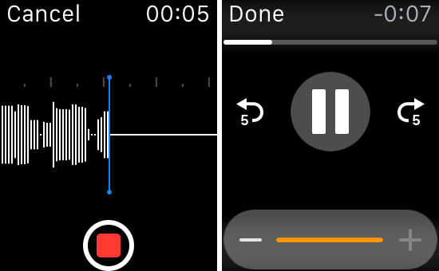

###Animation with Digital Crown

Coordinated Animations with WKInterfacePicker and Digital Crown.

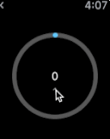

###Draw Paths (Updated by [hoppenichu](https://github.com/hoppenichu))

Draw paths with Core Graphics.

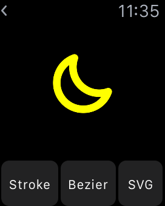

###Gradations (Updated by [hoppenichu](https://github.com/hoppenichu))

Draw gradations with Core Graphics.

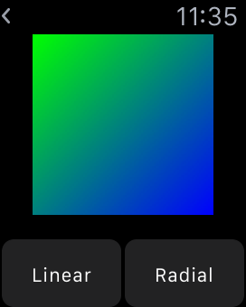

###Heart Rate (Created by [kitasuke](https://github.com/kitasuke))

Access to Heart Rate data using HealthKit.

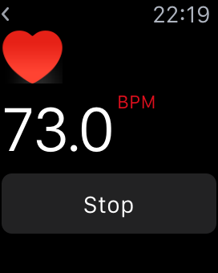

###Accelerometer

Access to Accelerometer data using CoreMotion.

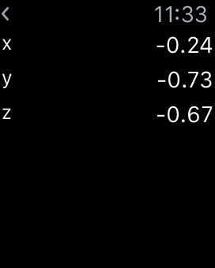

###Gyroscope (Not Available)

Access to Gyroscope data using CoreMotion. 

**These APIs are available, however CMMotionManager always returns `false` for `gyroAvailable`. So actually it's not available for now.**

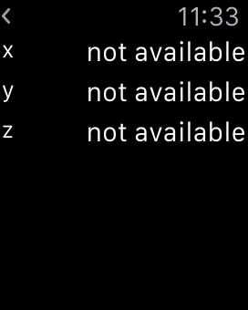

###Device Motion (Not Available)

Access to DeviceMotion data using CoreMotion. 

**These APIs are available, however CMMotionManager always returns `false` for `deviceMotionAvailable`. So actually it's not available for now.**

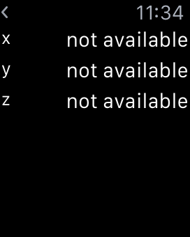

###Pedometer

Counting steps demo using CMPedometer.

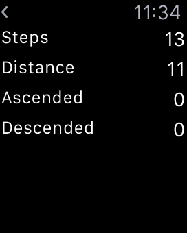

###Alert

Present an alert or action sheet.

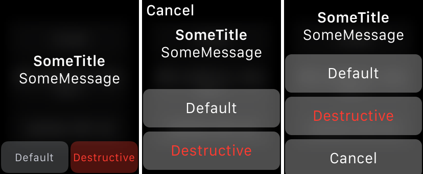

###Interactive Messaging

Sending message to phone and receiving from phone demo with WatchConnectivity.

###Audio File Player

Play an audio file with WKAudioFilePlayer.

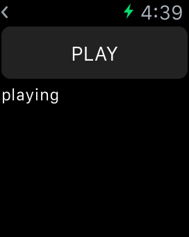

**Need to pair a Bluetooth headset on your Apple Watch.**

###Open System URL

Open Tel or SMS app using openSystemURL: method.

###Network Access (Created by [KAMEDAkyosuke](https://github.com/KAMEDAkyosuke))

Get an image data from network using NSURLSession.

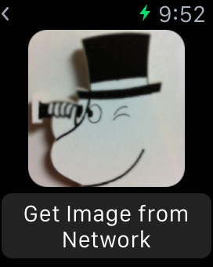

##Known Issues

- Open System URL
  - Phone doesn't launch...
  - It's based on the Apple's document. 
  - `sms:` works with same way. I have no idea why it doesn't work!

##iOS-9-Sampler

You can check the **examples for iOS 9** new features on [iOS-9-Sampler](https://github.com/shu223/iOS-9-Sampler)!!

- https://github.com/shu223/iOS-9-Sampler

##Author

**Shuichi Tsutsumi** (Freelance iOS engineer)

- [Twitter](https://twitter.com/shu223)
- [Facebook](https://www.facebook.com/shuichi.tsutsumi)
- [LinkedIn](https://www.linkedin.com/profile/view?id=214896557)
- [Blog (Japanese)](http://d.hatena.ne.jp/shu223/)

##Special Thanks

The icon is designed by [Okazu](https://www.facebook.com/pashimo).
