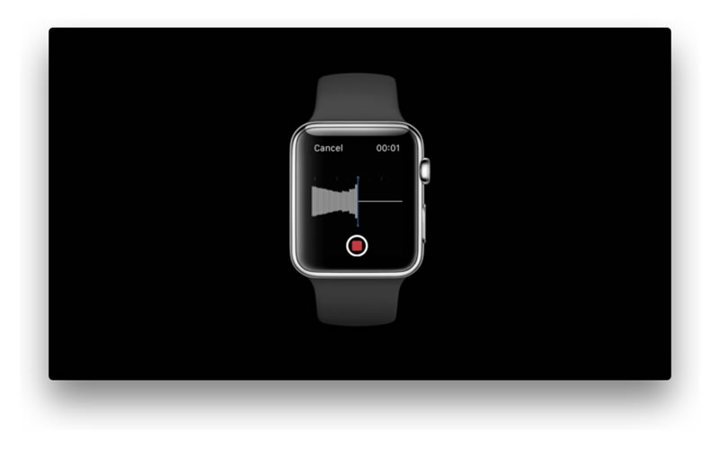

# watchOS-2-Sampler

Code examples for new features of watchOS 2.

##Requirements

- Xcode 7.0, iOS 9.0 SDK, watchOS 2.0 SDK
- iOS 9.0 and watchOS 2.0

##How to build

- Change the "Team" setting on [General] for each target.
- Setup HealthKit for the WatchKit extension target.

##Contents

**[note]**  ScreenShots will be available after the official release of watchOS 2 because of NDA. Some images are picked from WWDC session videos which are publicly opened by Apple.

###Accelerometer

Access to Accelerometer data using CoreMotion.

###Gyroscope

Access to Gyroscope data using CoreMotion.

###Pedometer

Counting steps demo using CMPedometer.

###Heart Rate

Access to Heart Rate data using HealthKit.

###Table Animations

Insert and remove animations for WKInterfaceTable.

###Animated Properties

Animate width/height and alignments.

###Audio Rec & Play

Record and play audio.

###Picker Styles

WKInterfacePicker styles catalog.

###Taptic Engine

Access to the Taptic engine using playHaptic method.

###Alert

Present an alert or action sheet.

###Animation with Digital Crown

Coordinated Animations with WKInterfacePicker and Digital Crown.

###Interactive Messaging

Sending message to phone and receiving from phone demo with WatchConnectivity.

###Open System URL

Open Tel or SMS app using openSystemURL: method.

###Audio File Player

Play an audio file with WKAudioFilePlayer.

##Author

Shuichi Tsutsumi

- [Twitter](https://twitter.com/shu223)
- [Facebook](https://www.facebook.com/shuichi.tsutsumi)
- [LinkedIn](https://www.linkedin.com/profile/view?id=214896557)
- [Blog (Japanese)](http://d.hatena.ne.jp/shu223/)

##Special Thanks

Icons are **designed by [Okazu](https://www.facebook.com/pashimo)**
